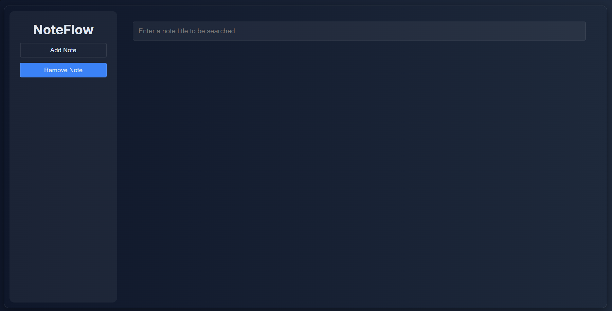
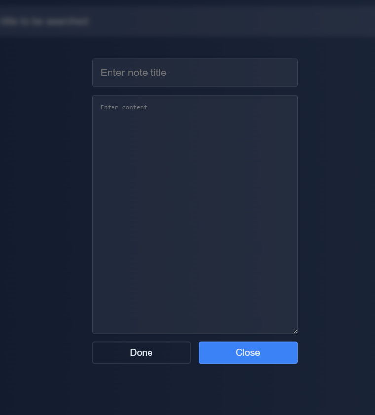
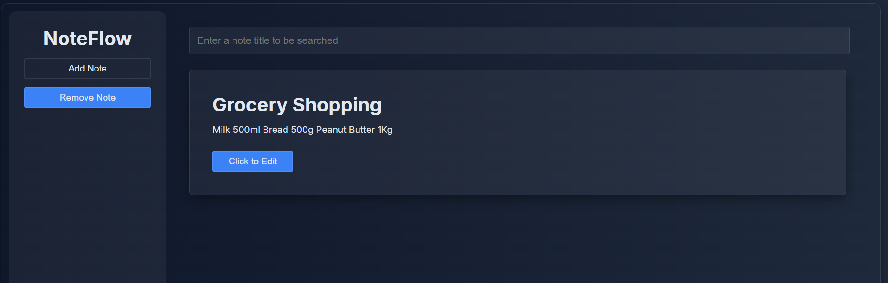

# 📒 Note App

A simple, lightweight note-taking application built using **HTML, CSS, and Vanilla JavaScript**, following **Object-Oriented Programming (OOP)** principles.

All notes are saved in **localStorage**, so they remain even after refresh.

---

## 🚀 Features

### ✔ Create Notes

Add a new note with a **title** and **content**.

### ✔ Edit Notes

Each note has an **Edit** button that lets you update its content.

### ✔ Delete Notes

Delete a note by entering its title. Matching is case-insensitive.

### ✔ Persistent Storage

All notes are saved inside:

```
noteStorage
```

in `localStorage`.

### ✔ OOP Architecture

The project is built using two classes:

* **Note** – represents a single note
* **NoteApp** – manages all notes and handles storage + UI rendering

---

## 🧱 Project Structure

```
/root
 ├── index.html
 ├── style.css
 └── script.js
```

---

## 🧠 How It Works

### `Note` Class

Represents a note with:

* ID (`noteId`)
* Title
* Content

### `NoteApp` Class

Handles:

* Adding notes
* Rendering all notes
* Editing notes
* Deleting notes
* Saving + loading notes from localStorage

---

## 🖼 Screenshots


```



```

---

## ⚙ Installation & Setup

### 1️⃣ Clone the Repository

```bash
git clone https://github.com/YOUR_USERNAME/YOUR_REPOSITORY.git
```

### 2️⃣ Move into the Project

```bash
cd YOUR_REPOSITORY
```

### 3️⃣ Run the App

Open `index.html` directly in your browser or run using VS Code **Live Server**.

---

## 🔧 Future Improvements

* Add full mobile responsiveness
* Replace `prompt()` with a proper modal
* Add delete button directly on each note card
* Add search functionality
* Add categories/labels
* Move from localStorage → Firebase or Supabase

---

## 📄 License

This project is open-source and free to use.

---
